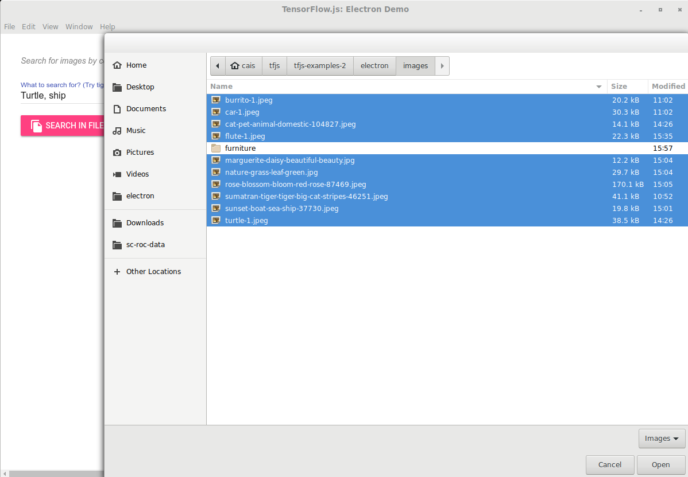
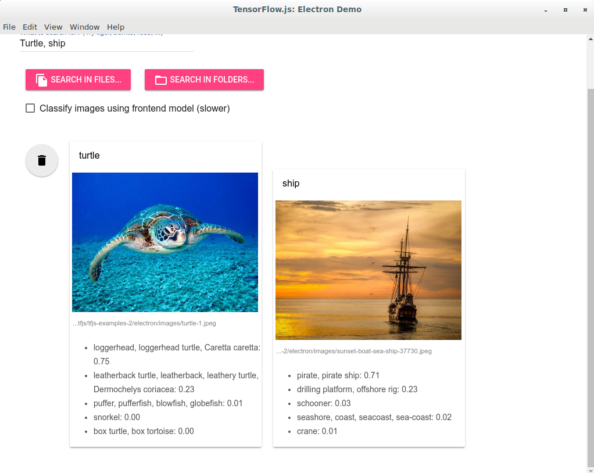

# Deploying TensorFlow.js Models in Electron-based Desktop Apps

This is a simple example that showcases how to use TensorFlow.js
in cross-platform desktop apps written with
[electron](https://electronjs.org/). In particular, it uses
a MobileNetV2 model running in TensorFlow.js to enable the user
to search for image files on the local filesystem by content
key words.

## How to use this example

1. Build and launch the app using:

   ```sh
   yarn
   yarn start
   ```

2. Specify the words you want to search for in the text field labeled
   "What to search for? ..." There can be one or more search words.
   If there are multiple search words, they should be separated with
   commas.

3. Click one of the "Search in files" and "Search in folders" buttons
   to choose the files or folders you want to search in. The former
   will pop open a dialog in which you can select multiple files, while
   the latter will open a dialog in which you are allowed to select
   multiple folders. See the screenshot below.

  

  If folders are selected, the app will search for
  all image files (with extension names .jpg, .jpeg and .png) in the
  folders recursively.

4. Once files or folders are selected, the app will load the image
   files and search over their contents by applying a convolutional
   neural network (convnet) on them. This may take a few seconds,
   especially if the number of files or folders you are searching over
   is large. In addition The first search action will take longer than
   subsequent ones, due to the need to download the convnet model
   from the Internet.

   The screenshot below shows an example of search results.

  

## Deploying the example as desktop apps

TODO(cais): To be added.


## Origin of images

All images used for demonstration purpose (in the image/) folder
are free-license images from https://pexels.com.