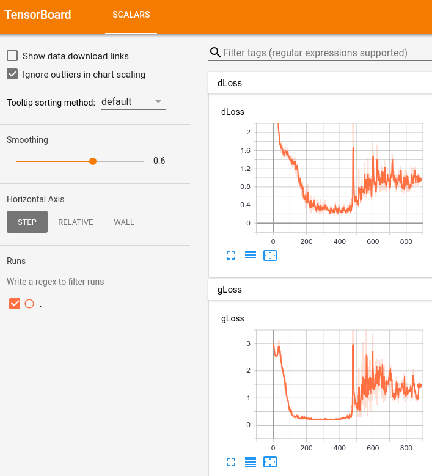

# TensorFlow.js Example: ACGAN on the MNIST Dataset

## What this example is about

This example trains an Auxiliary Classifier Generative Adversarial Network
(ACGAN) on the MNIST dataset.

For background of ACGAN, see:
 - Augustus Odena, Christopher Olah, Jonathon Shlens. (2017) "Conditional
   image synthesis with auxiliary classifier GANs"
   https://arxiv.org/abs/1610.09585

The training script in this example ([gan.js](./gan.js)) is based on the Keras
example at:
  - https://github.com/keras-team/keras/blob/master/examples/mnist_acgan.py

This example of TensorFlow.js runs simultaneously in two different environments:
 - Training in the Node.js environment. During the long-running training process,
   a checkpoint of the generator will be saved to the disk at the end of every
   epoch.
 - Demonstration of generation in the browser. The demo webpage will load
   the checkpoints saved from the training process and use it to generate
   fake MNIST images in the browser.
 
## How to use this example

This example can be used in two ways:

1. Performing both training and generation demo on your local machine,
   or
2. Run only the generation demo, by loading a hosted generator model from
   the web.

For approach 1, you can start the training by:
 
```sh
yarn
yarn train
```

If you have a CUDA-enabled GPU on your system, you can add the `--gpu` flag
to train the model on the GPU, which should give you a significant boost in
the speed of training:

```sh
yarn
yarn train --gpu
```

The training job is a long running one and takes a few hours to complete on
a GPU (using @tensorflow/tfjs-node-gpu) and even longer on a CPU
(using @tensorflow/tfjs-node). It saves the generator part of the ACGAN
into the `./dist/generator` folder at the beginning of the training and
at the end of every training epoch. Some additional metadata is
saved with the model as well.

### Monitoring GAN training using TensorBoard

The Node.js-based training script allows you to log the loss values from
the generator and the discriminator to
[TensorBoard](https://www.tensorflow.org/guide/summaries_and_tensorboard).
Relative to printing loss values to the console, which the=
training script performs by default, logging to tensorboard has the following
advantanges:

1. Persistence of the loss values, so you can have a copy of the training
   history available even if the system crashes in the middle of the training
   for some reason, while logs in consoles a more ephemeral.
2. Visualizing the loss values as curves makes the trends easier to see (e.g.,
   see the screenshot below).



To do this in this example, add the flag `--logDir` to the `yarn train`
command, followed by the directory to which you want the logs to
be written, e.g.,

```sh
yarn train --gpu --logDir /tmp/mnist-acgan-logs
```

Then install tensorboard and start it by pointing it to the log directory:

```sh
# Skip this step if you have already installed tensorboard.
pip install tensorboard

tensorboard --logdir /tmp/mnist-acgan-logs
```

tensorboard will print an HTTP URL in the terminal. Open your browser and
navigate to the URL to view the loss curves in the Scalar dashboard of
TensorBoard.

### Running Generator demo in the Browser
 
To start the demo in the browser, do in a separate terminal:
 
```sh
yarn
yarn watch
```

When the browser demo starts up, it will try to load the generator model
and metadata from `./generator`. If it succeeds, fake MNIST digits will
be generated using the loaded generator model and displayed on the page
right away. If it fails (e.g., because no local training job has ever
been started), the user may still click the "Load Hosted Model" button
to load a remotely-hosted generator.

### Training the model on CUDA GPUs using tfjs-node-gpu
 
It is recommended to use tfjs-node-gpu to train the model on a CUDA-enabled GPU,
as the convolution heavy operations run several times faster a GPU than on the
CPU with tfjs-node.

By default, the [training script](./gan.js) runs on the CPU using tfjs-node. To
run it on the GPU, repace the line 

```js
require('@tensorflow/tfjs-node');
```

with

```js
require('@tensorflow/tfjs-node-gpu');
```
